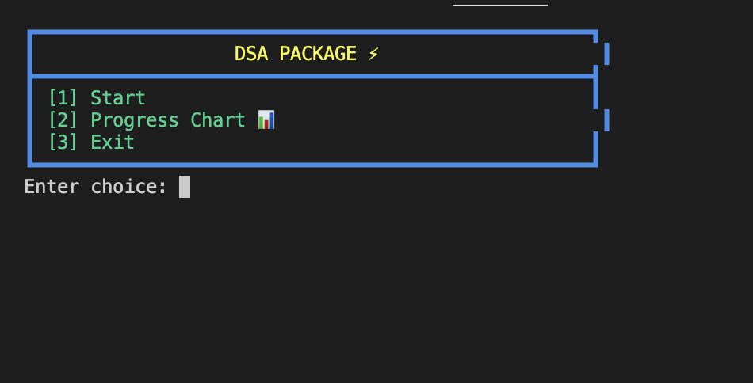
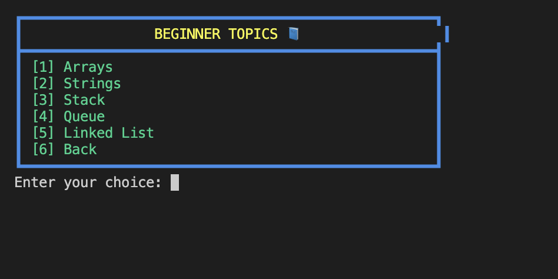
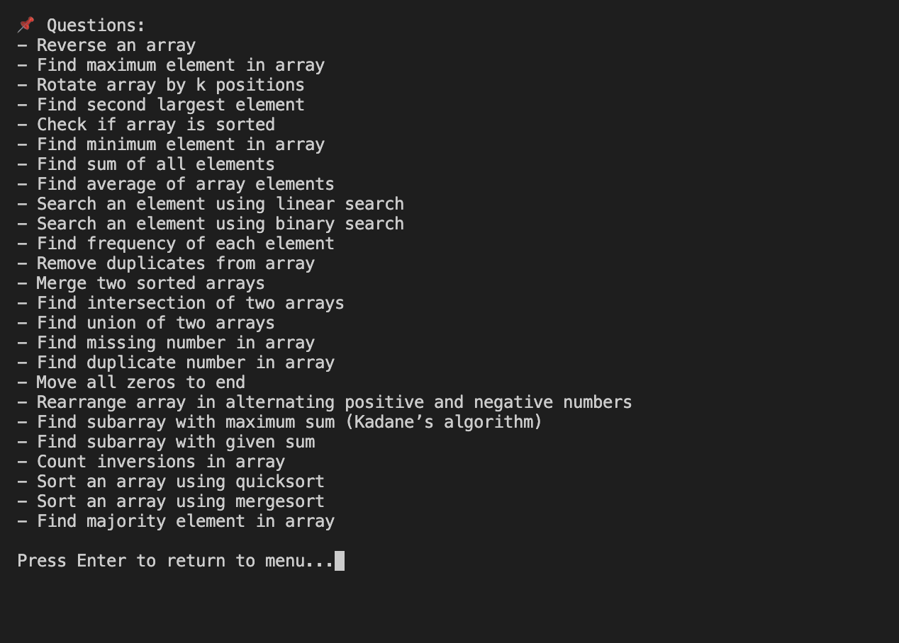
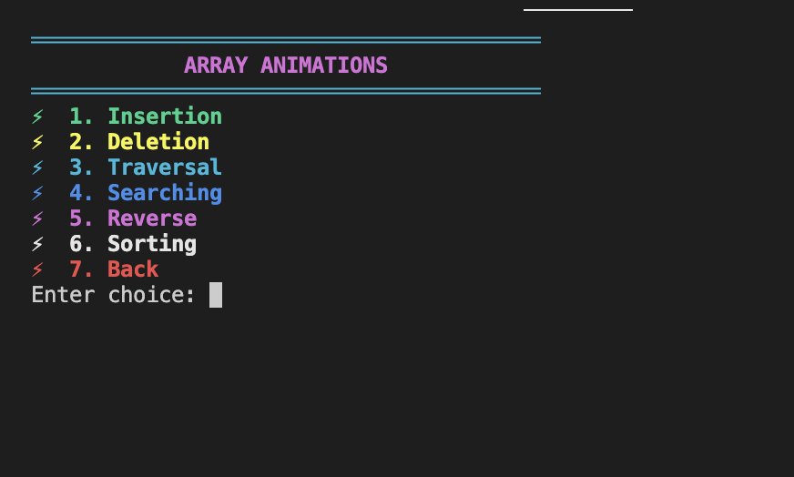
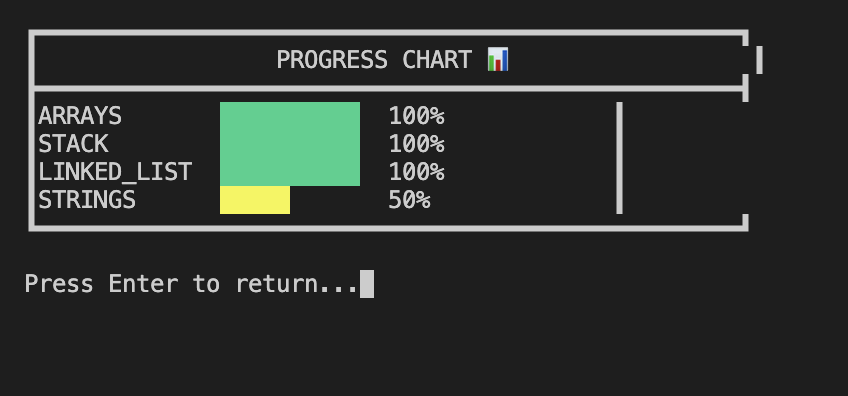

# DSA Package ⚡

A console-based **Data Structures & Algorithms Learning Platform** built in Python for students, beginners, and coding enthusiasts.

This project helps users learn DSA through:

- 📘 Theory explanations
- 💻 Code examples in Python / C++ / Java
- ❓ Practice questions
- 🧠 Quiz system
- 🎬 Console animations / visualizations
- 📈 Beginner, Intermediate, and Advanced levels
- 🎨 Beautiful terminal UI with loading screen and effects

---

# 🚀 Features

## 🟢 Beginner Level
- Arrays
- Strings
- Stack
- Queue
- Linked List

## 🟡 Intermediate Level
- Trees
- Sorting Algorithms
- Searching Algorithms
- Recursion

## 🔴 Advanced Level
- Graphs
- Heap
- Dynamic Programming
- Trie

---

# 🔄 Project Flowchart

```text
             ┌──────────────┐
             │   Start App  │
             └──────┬───────┘
                    ↓
          ┌──────────────────┐
          │  Loading Screen  │
          └────────┬─────────┘
                   ↓
          ┌──────────────────┐
          │     Main Menu    │
          └────────┬─────────┘
                   ↓
      ┌──────────────────────────┐
      │    Select Level          │
      │    Beginner / Int / Adv  │
      └──────---──┬──────────────┘
                  ↓
      ┌──────────────────────────┐
      │       Select Topic       │
      └───────---─┬─────────────-┘
                  ↓
   ┌───────────────────────────────┐
   │ Theory / Code / Quiz / Visual │
   └──────────────┬────────────────┘
                  ↓
             ┌──────────┐
             │   Exit   │
             └──────────┘
```

---

# 📁 Project Structure

```text
DSA-PACKAGE/
│── main.py
│── menu.py
│── levels.py
│── sample.py
│── structure.txt
│── README.md
│── .gitignore
│── firebase-key.json
│
├── animations/
│   ├── arrays_anim.py
│   ├── linked_list_anim.py
│   ├── queue_anim.py
│   └── stack_anim.py
│
├── content/
│   ├── __init__.py
│   ├── arrays.py
│   ├── dynamic_programming.py
│   ├── graphs.py
│   ├── heap.py
│   ├── linked_list.py
│   ├── queue.py
│   ├── recursion.py
│   ├── searching.py
│   ├── sorting.py
│   ├── stacks.py
│   ├── strings.py
│   ├── topic_handler.py
│   ├── trees.py
│   └── trie.py
│
├── core/
│
├── data/
│   ├── code.json
│   ├── progress.json
│   ├── questions.json
│   └── theory.json
│
├── services/
│   ├── __init__.py
│   ├── ai_service.py
│   ├── content_service.py
│   └── quiz_service.py
│
├── topics/
│   ├── __init__.py
│   ├── advanced.py
│   ├── beginner.py
│   └── intermediate.py
│
└── utils/
    ├── file_handler.py
    ├── progress.py
    ├── quiz_engine.py
    └── ui.py
```

---

# 📸 Screenshots



---



---



---



---



# 🧩 Module Wise Explanation

## 📄 main.py
Handles project startup and launches the application.

## 📄 menu.py
Controls navigation menus and user choices.

## 📄 levels.py
Manages Beginner, Intermediate, and Advanced level routing.

## 📁 topics/
Contains topic-wise modules like Arrays, Trees, Graphs, etc.

## 📁 content/
Stores theory notes, explanations, and examples.

## 📁 animations/
Contains console animations and visual demos.

## 📁 services/
Reusable logic such as quiz systems and helper services.

## 📁 utils/
Utility functions for colors, formatting, and screen handling.

## 📁 data/
Stores static data, questions, and quiz content.

---

# 📚 Algorithm / Topic List

## Core Data Structures
- Arrays
- Strings
- Stack
- Queue
- Linked List
- Trees
- Heap
- Trie
- Graphs

## Searching Algorithms
- Linear Search
- Binary Search

## Sorting Algorithms
- Bubble Sort
- Selection Sort
- Insertion Sort
- Merge Sort
- Quick Sort

## Problem Solving Topics
- Recursion
- Dynamic Programming
- Graph Traversal (BFS / DFS)

---

# 🛠 Requirements

- Python 3.8 or above installed

Check version:

```bash
python --version
```

or

```bash
python3 --version
```

---

# ▶️ How to Run on Local Computer

## 1️⃣ Clone the Repository

```bash
git clone https://github.com/shiva676466/DSA-Package.git
```

## 2️⃣ Go to Project Folder

```bash
cd DSA-Package
```

## 3️⃣ Run the Project

### Windows

```bash
python main.py
```

### macOS / Linux

```bash
python3 main.py
```

---

# 🎯 Educational Purpose

This project is designed for:

- Students learning DSA
- Beginners practicing coding concepts
- Quick revision of topics
- Interactive console learning

---

# 🚀 Future Scope

Planned improvements for upcoming versions:

- ✅ User Login System
- ✅ Progress Save Feature
- ✅ Topic Completion Tracker
- ✅ More Console Animations
- ✅ Search Topics Feature
- ✅ GUI Desktop Version
- ✅ Web Version
- ✅ AI Doubt Solver
- ✅ Daily Quiz Mode
- ✅ Leaderboard System

---

# 👨‍💻 Author

**Shiva**

GitHub: https://github.com/shiva676466

---

# 📜 License

This project is open for learning and educational use.
